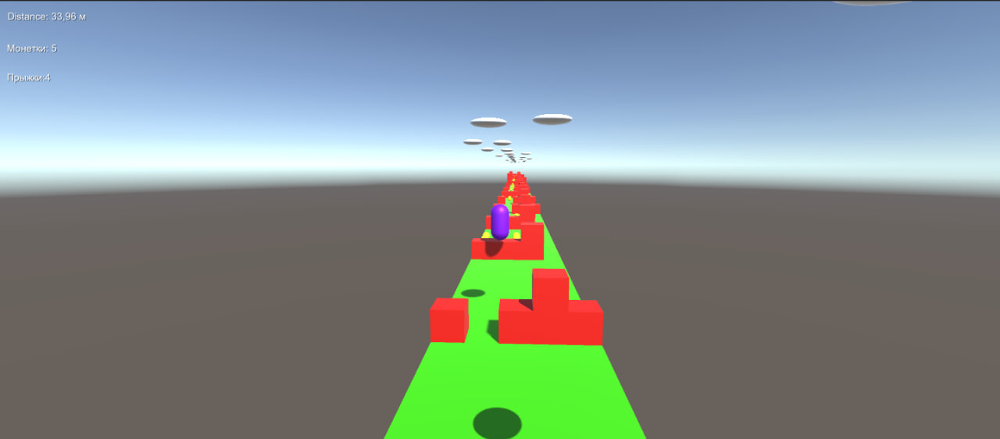
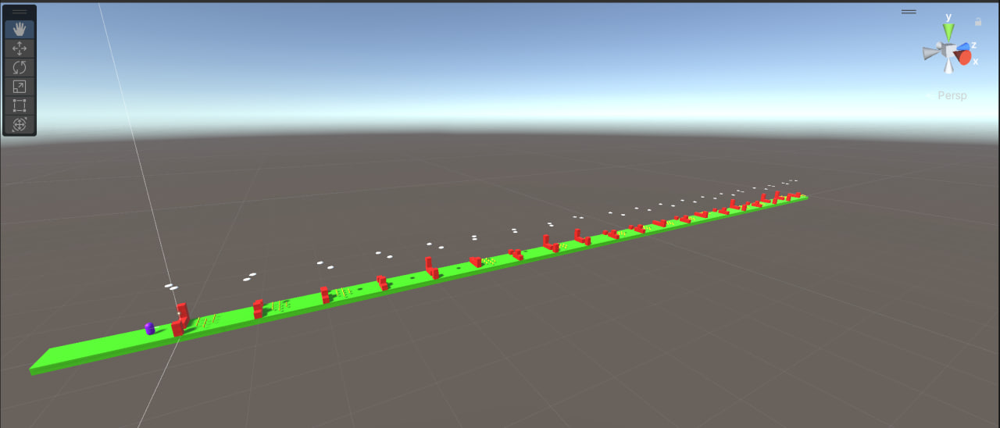

# 3Д платформер на UNITY(C#)

Это простенький 3д проект на Unity без текстур на моделях, сделанный в учебных целях.

**Присутствуют такие механики как:**

- Перемещение влево и вправо
- Прыжок на SPACE
- Уничтожение при соприкосновении с препядствием
- Показ пройденной дестанции, собранных монет и прыжков
- Бесконечная генерация дороги, облаков и препядствий

**Проект писался около 2 месяцев(1-2 раза в неделю)**

[Видео игрового процесса](123.mp4)